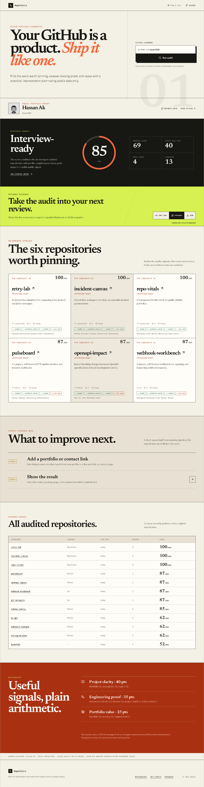

# RepoVitals

[](https://github.com/kyan9400/repo-vitals/actions/workflows/ci.yml)
[](https://github.com/kyan9400/repo-vitals/actions/workflows/deploy-pages.yml)
[](https://github.com/kyan9400/repo-vitals/releases/latest)
[](LICENSE)

A fast, transparent health check for public GitHub portfolios.

[Live demo](https://kyan9400.github.io/repo-vitals/) · [Report a bug](https://github.com/kyan9400/repo-vitals/issues/new?template=bug_report.yml)



## Why this exists

A GitHub profile is often reviewed in minutes. Useful work can be missed when the strongest repositories are not pinned, the project outcome is unclear, or basic trust signals such as tests and a license are absent.

RepoVitals turns those visible signals into a focused report. Enter any public GitHub username to get:

- a shortlist of six repositories worth pinning;
- an evidence-based score for each recently active original project;
- a prioritized queue of practical improvements;
- a transparent explanation of every point awarded;
- shareable report links and portable Markdown or JSON evidence.

No sign-in or API key is required. The app runs in the browser, reads public GitHub data, and caches the result locally for 15 minutes.

## Scoring

Each repository can earn 100 points:

| Area | Signal | Points |
| --- | --- | ---: |
| Project clarity | README | 20 |
| Project clarity | Description | 10 |
| Project clarity | Topics | 10 |
| Engineering proof | Automated checks | 15 |
| Engineering proof | License | 10 |
| Engineering proof | Project depth | 5 |
| Engineering proof | Active status | 5 |
| Portfolio value | Live link | 10 |
| Portfolio value | Recent activity | 10 |
| Portfolio value | Original work | 5 |

The portfolio score is 75% the average of the six strongest audited repositories and 25% profile completeness. Stars are displayed as context but never affect the score.

## Run locally

Requires Node.js 24 or newer.

```bash
git clone https://github.com/kyan9400/repo-vitals.git
cd repo-vitals
npm ci
npm run dev
```

Quality checks:

```bash
npm run lint
npm test
npm run build
```

## Architecture

- React and TypeScript for the interface and domain model
- Vite for local development and production builds
- GitHub REST API for public profile, repository, and file-tree metadata
- Vitest and Testing Library for deterministic scoring and accessibility tests
- GitHub Actions for continuous integration and Pages deployment

The API client audits up to 12 of the most recently pushed active, original repositories. File-tree checks run concurrently, and additional repository pages are fetched only when needed.

## API limits and privacy

Unauthenticated GitHub API use is rate-limited by GitHub. RepoVitals minimizes repeated requests with a 15-minute browser cache and shows a useful retry time when the limit is reached.

All processing happens in the browser. RepoVitals does not ask for a token, upload results, use analytics, or execute code from audited repositories.

Exports are generated locally from the current audit. Markdown is intended for planning notes and portfolio reviews; JSON preserves the complete public-data snapshot for further analysis.

## License

[MIT](LICENSE)
